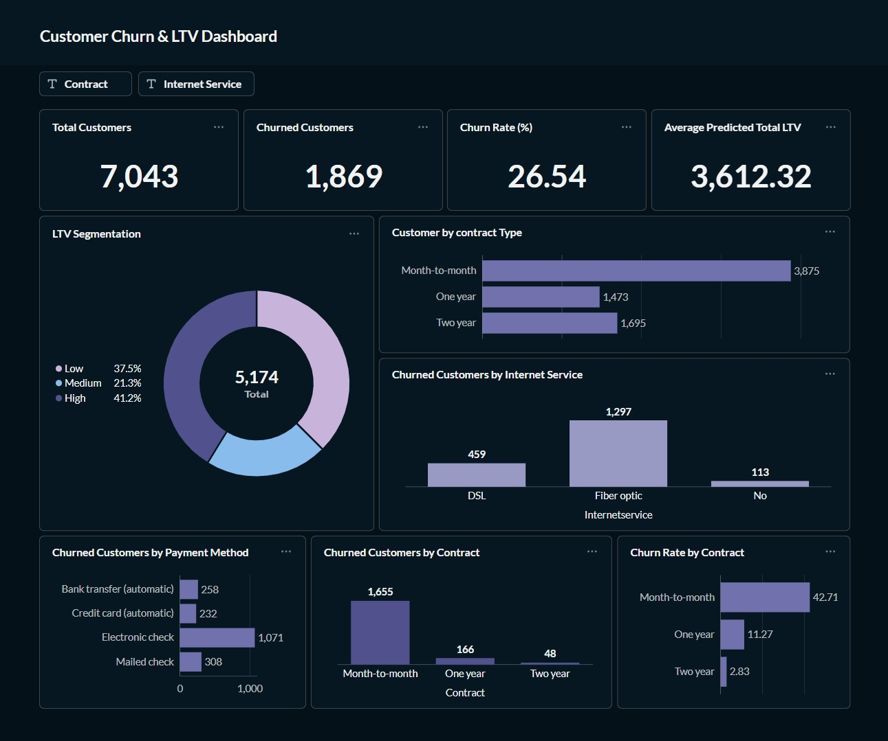

# Customer Churn Prediction & LTV Engine

An end-to-end customer analytics and machine learning project for **customer churn prediction and Customer Lifetime Value (LTV) estimation**.

The project combines **Python, SQL, PostgreSQL, Machine Learning, Survival Analysis, SHAP, FastAPI, Metabase, and Docker** to transform customer data into actionable business insights.

---

## Dashboard



The interactive Metabase dashboard provides:

- Total Customers: **7,043**
- Churned Customers: **1,869**
- Churn Rate: **26.54%**
- Average Predicted Total LTV: **~3,612**
- LTV Segmentation
- Churn analysis by Contract, Internet Service, and Payment Method
- Contract and Internet Service filters

---

## Business Problem

Customer churn reduces recurring revenue and increases customer acquisition costs. Customers also differ in their potential business value.

This project aims to:

- Identify customers at higher risk of churn
- Understand patterns associated with churn
- Estimate remaining customer lifetime
- Predict survival-derived LTV
- Support value-based customer retention decisions

---

## Project Approach

```text
Customer Data
      ↓
Data Cleaning & EDA
      ↓
Feature Engineering
      ↓
 ┌───────────────┬
 ↓               ↓
Churn         Survival Analysis
Prediction        ↓
 ↓           Remaining Lifetime
Logistic           ↓
Regression   Survival-derived LTV
                  ↓
             Tuned XGBoost
                  ↓
               FastAPI
                  ↓
             PostgreSQL
                  ↓
              Metabase
```

---

## Churn Prediction

Classification models evaluated:

- Logistic Regression
- Random Forest
- XGBoost

Models were evaluated using **Precision, Recall, and F1-score**.

**Logistic Regression** was selected as the current churn prediction model based on the evaluated F1-score.

**SHAP** was used to understand which customer features contribute to churn predictions.

---

## LTV Prediction

Survival analysis was used to estimate the expected remaining lifetime of active customers.

The survival-derived LTV target was constructed as:

```text
Expected Remaining Lifetime × Monthly Charges
                    =
       Survival-derived Remaining LTV
```

Regression models were evaluated using MAE, RMSE, and R².

| Model | MAE | RMSE | R² |
|---|---:|---:|---:|
| Linear Regression | ~403.26 | ~511.42 | ~0.9476 |
| Random Forest | ~97.13 | ~177.74 | ~0.9658 |
| XGBoost | ~137.48 | ~215.02 | ~0.9499 |
| **Tuned XGBoost** | **~60.48** | **~95.87** | **~0.9900** |

The **Tuned XGBoost Regressor** achieved the best performance against the constructed survival-derived LTV target.

> **Note:** The dataset is a historical customer snapshot without directly observed future revenue. Therefore, LTV is a **survival-derived proxy**, and the R² of ~0.99 should not be interpreted as 99% accuracy on actual future revenue.

### LTV Segmentation

| Segment | Predicted Total LTV |
|---|---:|
| Low LTV | < 2,000 |
| Medium LTV | 2,000 – < 4,000 |
| High LTV | ≥ 4,000 |

---

## Key Business Insights

- **Month-to-month customers have the highest churn rate:** 42.71%, compared with 11.27% for one-year contracts and 2.83% for two-year contracts.
- **Longer-tenure customers generally show better retention**, highlighting the importance of early customer engagement.
- **Churned customers generally have higher monthly charges**, suggesting pricing and perceived value could be investigated.
- **Fiber optic customers show relatively high churn**, making this segment worth further investigation.
- **Electronic check users represent a high volume of churned customers**, suggesting billing and payment behavior could be explored.
- Combining **churn risk and customer value** can help prioritize retention efforts.


---

## FastAPI & PostgreSQL

A **FastAPI service** was developed to serve the trained LTV model.

| Endpoint | Method | Purpose |
|---|---|---|
| `/health` | GET | Health check |
| `/predict` | POST | Single-customer prediction |
| `/predict/batch` | POST | Batch prediction |

Predictions generated through the API are stored in PostgreSQL.

Example:

```json
{
  "predicted_remaining_ltv": 2903.57
}
```

---

## Docker

The FastAPI application was containerized using Docker.

```bash
docker build -t customer-ltv-api .
```

```bash
docker run -p 8000:8000 --env-file .env customer-ltv-api
```

API documentation:

```text
http://localhost:8000/docs
```

The containerized application was tested for API startup, predictions, batch predictions, PostgreSQL connectivity, and prediction storage.

---

## Project Structure

```text
customer churn/
│
├── api/
│   └── main.py
├── dashboard/
│   └── dashboard.jpeg
├── data/
├── models/
│   └── ltv_xgboost_model.pkl
├── notebooks/
├── reports/
├── sql/
│   └── analysis_queries.sql
├── Dockerfile
├── .gitignore
├── README.md
├── requirements.txt
└── requirements-api.txt
```

---

## Technologies

**Python · Pandas · NumPy · Seaborn · SQL · PostgreSQL · Scikit-learn · XGBoost · SHAP · Survival Analysis · FastAPI · SQLAlchemy · Metabase · Docker · Git · GitHub**


---

## Project Status

**Completed**

This project demonstrates an end-to-end predictive analytics workflow:

**Data → Analysis → Churn Prediction → Survival Analysis → LTV Prediction → FastAPI → PostgreSQL → Metabase → Docker**
